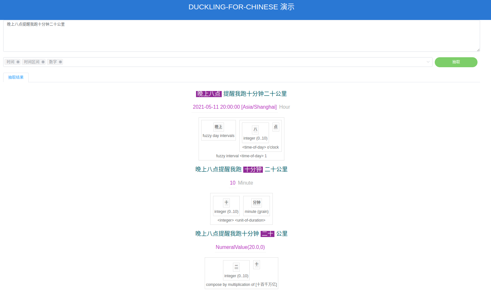

# duckling-fork-chinese
[](https://codecov.io/gh/du00cs/MiNLP)

[facebook/duckling](https://github.com/facebook/duckling)项目的scala复刻版，本项目录目前只服务于中文解析，暂时只提供中文文档。

> 每一种支持的解析类型，比如时间、数字等，被称为一个dimension。

[支持的Dimension](./doc/支持的Dimension.md)

想更多了解duckling是什么，与同类工具的比较可以参考[Duckling/Introduction](https://duckling.wit.ai/#introduction)。

目前文档稀少，需要补充什么，欢迎在Issue区提。

## 1. 调用

在使用之前，适当进行繁转简、全角转半角，可以减轻匹配压力。

返回结果的结构需要提前了解定义，暂不在此中列出，目前需要自行查看代码。

## 1.1 Scala

> 发布到开放仓库，还在sonatype的申请流程中

```
sbt - "duckling" % "duckling-core_2.11" %% VERSION
```

```scala
import duckling.Api
import duckling.dimension.place.{Place, PlaceData}

val answers = Api.analyze(ns, new Context(), Options(targets = Set(Place)))
val candidates = answers.flatMap { answer =>
  // answer.token.value是一个ResolvedValue，ResolvedValue是所有结果的共同trait，需要强转/匹配至实现
  answer.token.value match {
    case placeData: PlaceData =>
      placeData.candidates.map(c => (c.getPathStr(), answer.token))
    case _ => Nil
  }
}
```

## 1.2 Java

做了方便Java使用的analyzeJ方法，如果觉得使用不够顺滑可以在issue区提出难受的点。

```
gradle - duckling:duckling-core_2.11:VERSION
```

```java
import com.google.common.collect.Sets;
import duckling.Api;
import duckling.Types.Context;
import duckling.Types.Options;
import duckling.dimension.EnumeratedDimension;

List<EnumeratedDimension> dims = Lists.newArrayList(EnumeratedDimension.Time, EnumeratedDimension.Duration);
final Types.Context context = new Types.Context(ZonedDateTime.now(), Locale.CHINA);
final Types.Options options = new Types.Options(dims, false);

Context context = new Context(LocalDateTime.now(), Locale.CHINA);
String query = ...;
List<Answer> answers = Api.analyzeJ(query, context, options);

answers.stream().map(answer -> {
    answer.token().range(); // 文本区间 [x, y)
    ResolvedValue value = answer.token().value();
    if(value instanceof TimeValue) {
        TimeValue tv = (TimeValue) value;
        tv.holiday(); // 如果是从清明节识别来的，这里会标记"清明"
        // 时间点
        if(tv.timeValue() instanceof SimpleValue) {
            InstantValue t = ((SimpleValue) tv.timeValue()).instant();
            t.datetime(); // LocalDateTime 时间点
            t.grain(); // 粒度
        } else if(tv.timeValue() instanceof IntervalValue) {
            // 左闭右开
            IntervalValue interval = (IntervalValue) tv.timeValue();
            interval.start().datetime();
            interval.end().datetime();
        }
    }
    // ...
});
```

### 1.3 API&WEB

项目从[duckling.wit.ai](https://duckling.wit.ai/)抽取了部分样式，仿了一版可视化解析的代码（无意冒犯，侵删）。

**测试**

```bash
sbt
> project server
> runMain com.xiaomi.duckling.server.DucklingApplication
```

**打包**

```bash
# （可选）训练模型，如果不提供naive_bayes.json，会在启动时现场训练
sbt "project server; runMain duckling.ranking.NaiveBayesRank naive_bayes.json"
cp server/naive_bayes.json server/src/main/resources/

# 打包
sbt server/stage

cd server/target/universal/stage
bash bin/duckling-server
```


在线体验Demo：`/duckling?dim=...&query=...`

[晚上八点提醒我跑十分钟二十公里](https://duckling-preview.ai.xiaomi.com/)




URL中有dim参数，多个dim用,隔开，dim需要在URL中手工输入，了解前端的同学可以帮忙贡献一个页面交互（现在的开发对这些一窍不通）。

API调用：`/api?dim=...&query=...` 

## 2. Style Guide

Intellij IDEA的设置中打开`Editor -> Code Style -> Scala`，点击Scheme右侧的小按钮，`Import Scheme…`，选择本项目下的`intellij_formating.xml`。

## 3. 发布

只会发布core项目，其它的会跳过：

```scala
sbt ci-release
```

## 4. 如何新增一个Dimension

duckling-fork-chinese 对每一类模式词的抽取，创建了一类Dimension，如：Numeral, Time, PhoneNumber, ...等等
需要新增一类模式词时请注意以下要求：

- 在core/src/main/scala/duckling/dimension路径下新增该如何新增一个Dimension的目录
- 在FullDimensions和EnumeratedDimension中引入新定义的Dimension
- 在新目录下给出该功能的测试Examples
- 在编写该Dimension的解析规则时尽可能复用现有的Dimension

## 5. 如何参与

参考[How to Contribute](./doc/CONTRIBUTING.md)

## 6. License

duckling-fork-chinese Apache 2.0

项目是在用Scala重写facebook/duckling的基础上开展的，另附上duckling的原BSD License
