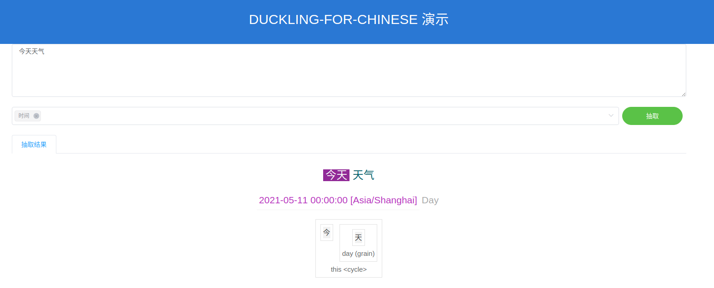

# duckling-server  

## 1、[Demo演示](https://duckling-preview.ai.xiaomi.com/)


## 2、Demo使用方法：  
* 2.1、在文本框中输入待抽取的文本  
* 2.2、下拉框选择抽取的类型（多选，未选择默认抽取所有类型）
* 2.3、点击抽取按钮，或在文本框中回车提交抽取


## 3、打包

```bash
# （可选）训练模型，如果不提供naive_bayes.json，会在启动时现场训练
sbt "project server; runMain duckling.ranking.NaiveBayesRank naive_bayes.json"
cp server/naive_bayes.json server/src/main/resources/

# 打包
sbt server/stage

cd server/target/universal/stage
bash bin/duckling-server
```

## 4、启动
```bash
sbt
> project server
> runMain com.xiaomi.duckling.server.DucklingApplication
```